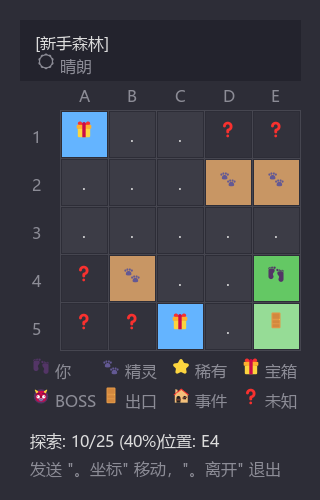
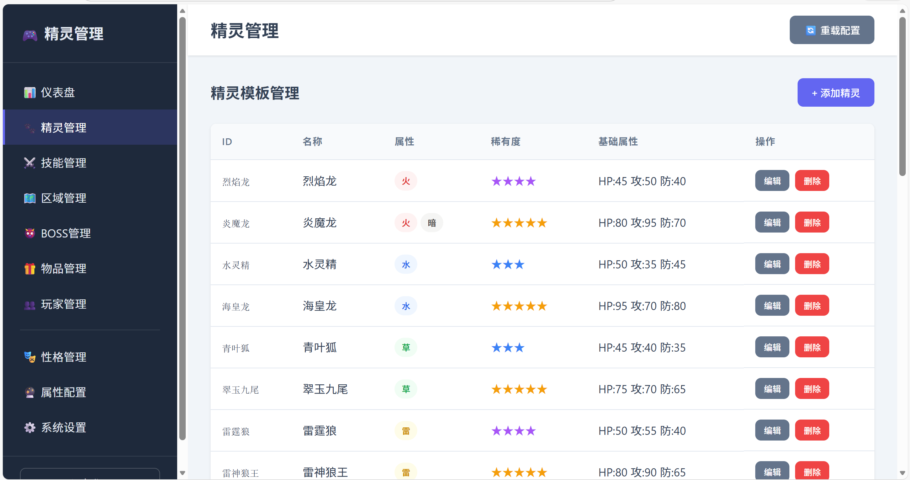

# 🎮 精灵世界 (Elves World) for AstrBot

> **版本**: v1.0.0 | **作者**: DITF16  
> **适配**: AstrBot

**精灵世界** 是一款为 AstrBot 设计的深度 RPG 养成对战插件。它在群聊中构建了一个完整的精灵冒险世界，玩家可以探索地图、捕捉精灵、挑战BOSS、培养队伍，并与其他玩家进行对战。

## ✨ 核心特性

*   **🌍 开放世界探索**
    *   多区域地图：森林、火山、雪原、深海等 12+ 个特色区域。
    *   迷雾系统：探索未知地块，触发随机事件（战斗、宝箱、奇遇）。
    *   动态天气：雨天、晴天、沙暴等天气影响战斗局势。
    *   独特的走格子区域探索模式快来体验吧！
    *   

*   **⚔️ 深度回合制战斗**
    *   属性克制：水克火、火克草... 经典的属性克制系统。
    *   技能体系：物理/特殊攻击、变化类技能、状态异常（中毒、麻痹、烧伤）。
    *   智能 AI：野生精灵和 Boss 拥有独特的战斗逻辑。

*   **👾 精灵养成系统**
    *   收集图鉴：数百种原创精灵等待发现。
    *   个体值/努力值：硬核的数值养成系统。
    *   进化路线：达到等级或使用特定道具即可进化。
    *   性格系统：不同性格影响属性成长。

*   **🎒 丰富的游戏生态**
    *   经济系统：金币与钻石，商店购买精灵球、药水、进化石。
    *   签到福利：每日签到领取补给。
    *   排行榜：战力排行、图鉴排行，角逐最强训练家。

*   **🖥️ Web 管理后台**
    *   内置可视化后台，管理员可在线编辑精灵、技能、物品、地图数据。
    *   支持热重载配置，无需重启机器人。

---

## 🚀 安装与使用

### 安装插件
在 AstrBot 插件市场搜索：astrbot_plugin_elves_world

### 快速开始
1.  **注册账号**：发送 `/精灵 注册`
2.  **领取新手礼包**：发送 `/精灵 签到`
3.  **开始冒险**：发送 `/精灵 探索 新手森林`
4.  **查看状态**：发送 `/精灵 我`

---

## 📖 指令列表

默认指令前缀为 `精灵`（可在配置中修改）。

| 指令 | 说明           | 示例 |
| :--- |:-------------| :--- |
| **基础指令** |              | |
| `注册` | 注册游戏账号       | `/精灵 注册` |
| `我` / `个人信息` | 查看个人信息、体力、资产 | `/精灵 我` |
| `签到` | 每日签到获取奖励     | `/精灵 签到` |
| `背包` | 查看拥有的物品      | `/精灵 背包` |
| `排行` | 查看排行榜        | `/精灵 排行` |
| **精灵管理** |              | |
| `队伍` | 查看当前携带的精灵    | `/精灵 队伍` |
| `详情 <序号>` | 查看精灵详细数值     | `/精灵 详情 1` |
| `进化 <序号>` | 进化指定精灵       | `/精灵 进化 1` |
| `改名 <序号> <新名>` | 修改精灵昵称       | `/精灵 改名 1 皮卡丘` |
| `放生 <序号>` | 放生精灵（不可逆）    | `/精灵 放生 1` |
| **冒险与战斗** |              | |
| `区域` | 查看可探索的区域列表   | `/精灵 区域` |
| `探索 <区域名>` | 进入地图探索       | `/精灵 探索 新手森林` |
| `地图` | 查看当前探索地图状态   | `/精灵 地图` |
| `离开` | 退出当前探索/战斗    | `/精灵 离开` |
| `战斗` | 快速进入人机对局     | `/精灵 战斗` |
| **商店与物品** |              | |
| `商店` | 查看商店物品       | `/精灵 商店` |
| `购买 <物品> <数量>` | 购买物品         | `/精灵 购买 精灵球 10` |
| `使用 <物品> <对象>` | 使用物品         | `/精灵 使用 治疗药水 1` |

### 🎮 游戏内操作
在探索或战斗状态下，使用 **操作前缀**（默认为 `。`）进行快捷操作：

*   **探索时**：
    *   `。A1`、`。B2`：移动到指定坐标。
    *   `。离开`：退出地图。
*   **战斗时**：
    *   `。1`、`。2`：使用第 1/2/3/4 个技能。
    *   `。捕捉`：使用精灵球捕捉野生精灵。
    *   `。逃跑`：尝试逃离战斗。
    *   `。背包`：打开战斗背包使用药水。

---

## ⚙️ 配置说明

在 AstrBot 插件配置面板中可调整以下设置：

### 1. 游戏设置 (`game_settings`)
*   `stamina_recovery_minutes`: 体力恢复速度（默认 5 分钟/点）。
*   `max_stamina`: 体力上限（默认 100）。
*   `max_team_size`: 队伍携带上限（默认 6）。

### 2. 战斗倍率 (`battle_settings`)
*   `exp_multiplier`: 经验获取倍率。
*   `catch_rate_multiplier`: 捕捉成功率倍率。

### 3. Web 管理后台 (`web_admin`)
*   `enabled`: 是否启用 Web 后台（默认关闭，建议开启）。
*   `host`: 监听地址（`0.0.0.0` 允许外网访问）。
*   `port`: 端口号（默认 `8765`）。
*   `admin_password`: **重要**！请务必修改默认密码 `admin123`。

启用后，访问 `http://<机器人IP>:8765` 即可进入管理后台。

---

## 🛠️ 数据管理

本插件使用 SQLite 数据库存储玩家数据，默认路径：
`data/plugins/astrbot_plugin_elves_world/game.db`

游戏配置（精灵、技能、地图等）为 JSON 格式，支持通过 Web 后台热更新，无需直接修改文件。

---

> Created with ❤️ by DITF16
